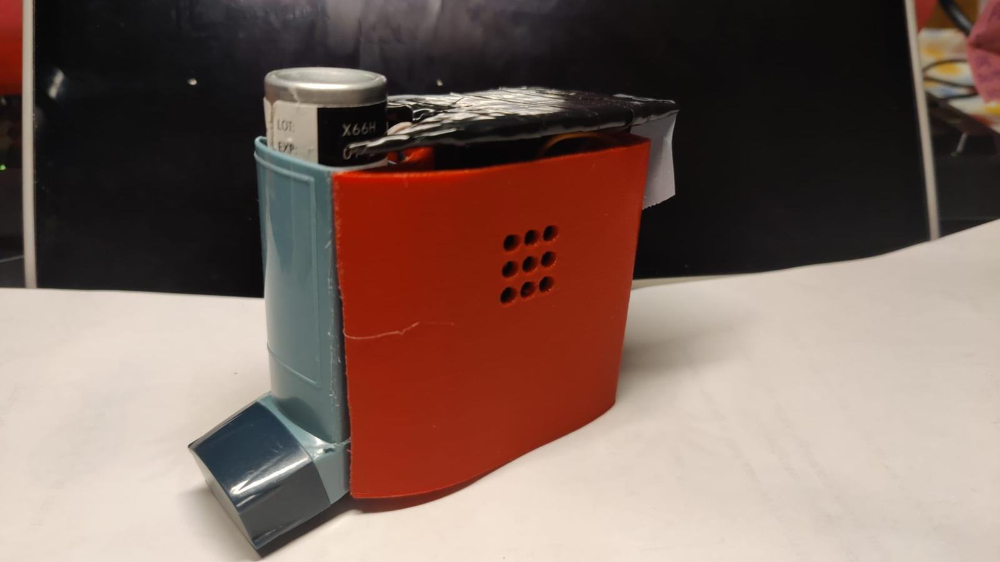
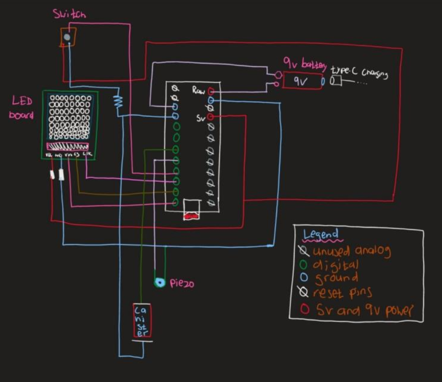

# Inhaler Solution Project

Welcome to the Inhaler Solution Project! This project aims to create an accessible and user-friendly inhaler counter for visually impaired individuals. This README provides a detailed overview of the software and circuit aspects of the project. 

## Table of Contents
1. [Introduction](#introduction)
2. [Features](#features)
3. [Hardware Components](#hardware-components)
4. [Circuit Diagram](#circuit-diagram)
5. [Software Implementation](#software-implementation)
6. [Assembly Instructions](#assembly-instructions)
7. [Testing and Validation](#testing-and-validation)
8. [Future Improvements](#future-improvements)
9. [Acknowledgements](#acknowledgements)

## Introduction
The Inhaler Solution Project is designed to assist visually impaired users in monitoring their inhaler dosages. Current inhaler solutions often rely heavily on visual cues, which are not accessible to users with visual impairments. Our design incorporates auditory and tactile feedback to ensure usability for all users.

## Features
- **Accurate Puff Counting**: Monitors the remaining puffs in the inhaler and alerts the user when the inhaler is almost empty.
- **Auditory Feedback**: Uses a piezo buzzer to provide auditory alerts for different dosage levels.
- **Visual Feedback**: An 8x8 LED matrix displays visual cues about the remaining puffs.
- **Easy Reset**: Allows users to reset the puff count easily via a push button.
- **Low Battery Consumption**: Efficiently designed to run on a rechargeable 9V battery.

## Hardware Components
- **Arduino Pro Micro**: The main controller for the project.
- **Piezo Buzzer**: Provides auditory feedback for different puff levels.
- **Push Button**: Allows users to reset the puff count and set the initial puff count.
- **8x8 LED Matrix**: Displays visual feedback for the remaining puffs.
- **Rechargeable 9V Battery**: Powers the entire system.
- **Jumper Wires**: Connects all components.
- **Lead Coil and Baseplate**: Detects inhaler usage to decrement puff count.

## Circuit Diagram
To ensure the best understanding and replication of the circuit, please refer to the detailed circuit diagram provided in the documentation. The diagram includes all necessary connections and components.

## Software Implementation

The code for this project is written in C++ and runs on the Arduino platform. The code is responsible for monitoring button presses, inhaler usage, and updating the LED matrix and buzzer based on the remaining puffs.

## Key Functions
- `full()`: Lights up the entire LED matrix.
- `half()`: Lights up half of the LED matrix.
- `xfunction()`: Displays an "X" on the LED matrix and buzzes the piezo.
- `updateDisplay()`: Updates the LED matrix based on the remaining puffs.
- `gradient()`: Shows a gradient effect on the LED matrix during the reset process.
- `SetPuffs(int original)`: Allows the user to set the initial puff count via button clicks.

## Assembly Instructions
1. **Component Soldering**: Solder the necessary headers onto the Arduino Pro Micro if not pre-soldered.
2. **Circuit Construction**: Connect the components as per the circuit diagram. Use jumper wires for connections and ensure secure connections with electrical tape.
3. **Power Supply**: Attach the 9V battery and ensure a stable power supply to the Arduino.
4. **Enclosure Assembly**: Place the assembled circuit into the 3D printed case. Secure the components to prevent movement and ensure the reset button and LED matrix are properly aligned with their respective holes in the case.
5. **Final Checks**: Double-check all connections and ensure there are no short circuits.

## Testing and Validation
Our design was tested for various parameters to ensure compliance with our goals:

- **Attention Grabbing**: The piezo buzzer and LED matrix were tested in different environments to ensure they are noticeable.
- **Accurate Counting**: Multiple tests were conducted to ensure the puff count accuracy.
- **Non-disruptive Process**: The design was evaluated to ensure it does not interfere with the inhalation process.
- **Durability**: Drop and shake tests were conducted to verify the robustness of the design.
- **Portability**: The final product was tested for ease of transport in small bags and pockets.

## Future Improvements
- **Smaller Wires**: Use shorter and thinner wires to reduce clutter and improve electrical safety.
- **Lower Voltage Battery**: Consider a more reliable and longer-lasting battery to improve overall efficiency.
- **Smaller Microchip**: Replace the Arduino Pro Micro with a smaller microchip to reduce the size and cost of the device.
- **Programmable Speaker**: Upgrade the piezo buzzer to a programmable speaker for better auditory feedback.

## Acknowledgements
This project was completed as part of a collaborative effort by the following team members: Kangmengjie Wu, Krishna Gowda, Leo Wallner, Xristopher Aliferis, Anthony Garant, and Ali Masood. Special thanks to the Western University Faculty of Engineering for their support and resources.

Additionally, a video demonstration of the device in action can be found [here](https://photos.app.goo.gl/ZSRYMpd52zBB2q329).
